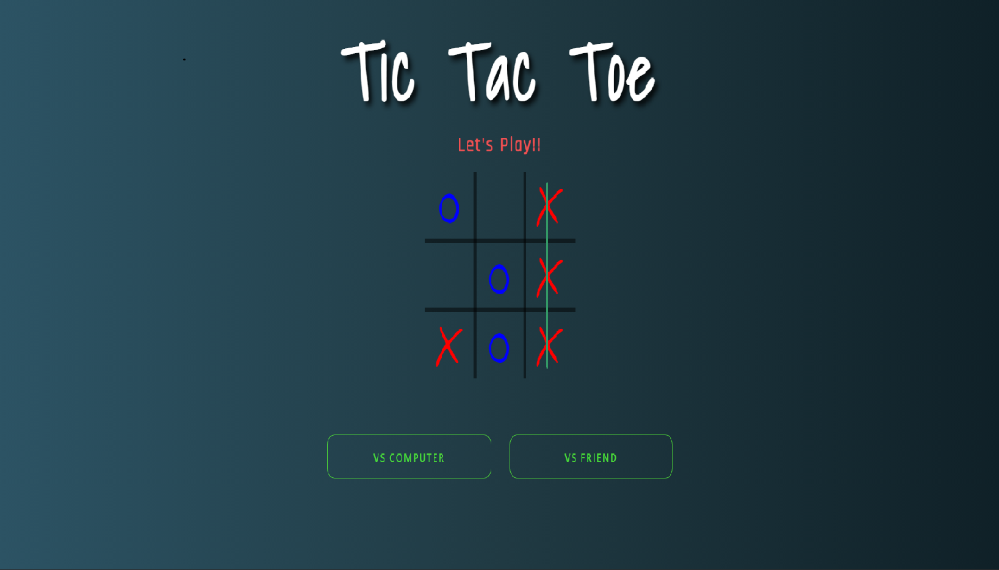

# tic-tac-toe

## Description

The Project is based on famous Tic-tac-toe game.You can play the game both as single player and multiplayer.
Since its realtime multiplayer game , players can play together from their respective devices at realtime.
The Backend is deployed on Heroku & the Webapp is Deployed on Netlify.
### `Tech Stacks`

### Frontend
 - ReactJs
 - Socket.io
### Frontend
 - NodeJs
 - ExpressJs
 - Mongodb
 - Socket.io

[Backend](https://github.com/Soham-Official/tic-tac-toe_backend) Code of this App

# Project Created by:
  [Soham Chakraborty](https://soham-official.github.io/)        

